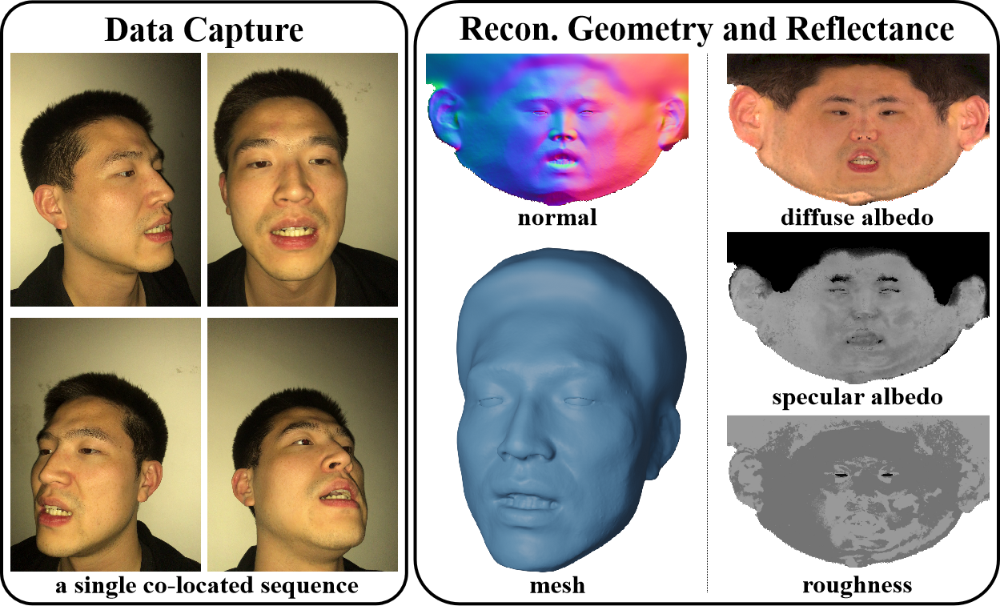
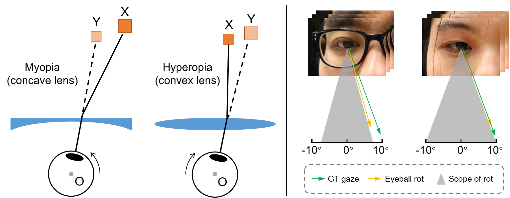
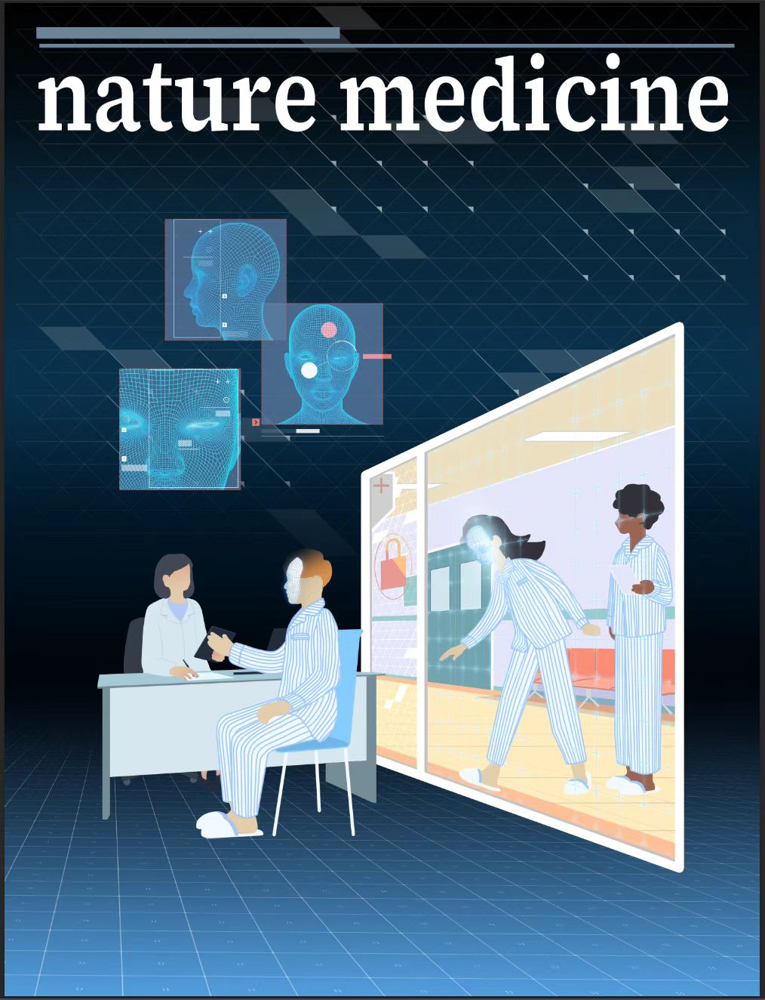
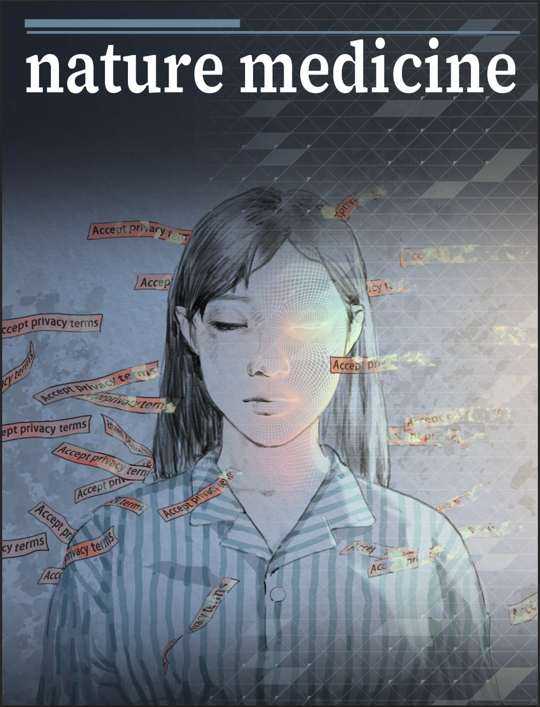
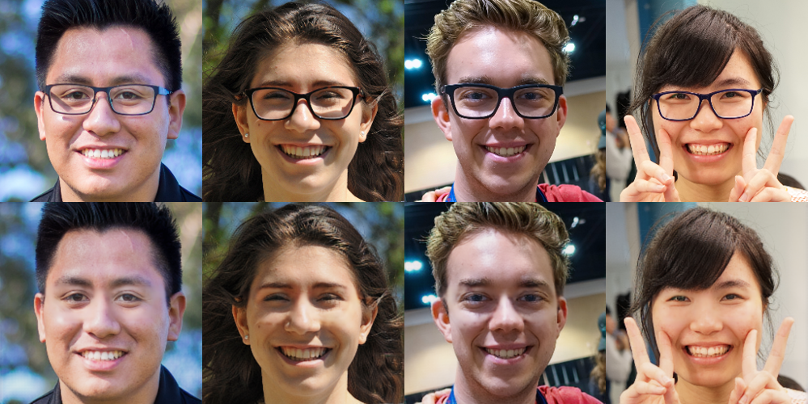

I am a Ph.D. candidate at School of Software, [Tsinghua University](https://www.tsinghua.edu.cn/en/) (THU), supervised by Prof. [Feng Xu](http://xufeng.site/).

My research interests lie in <b>Computer Vision</b> and <b>Graphics</b>, and I am willing to apply techniques to other research fields.

Education
------

  <b>Tsinghua University, Beijing, China</b>  
  September 2019 -    
  Ph.D. in Software Engineering at School of Software 
   <b>GPA 3.91/4.0, Rank 2/37</b>  

  <b>Beihang University, Beijing, China</b> 
  September 2015 - June 2019  
  B.E. in Software Engineering at School of Software 
   <b>GPA 3.82/4.0, Rank 4/156</b>  

  

Publications
------

  

  

    
      <b>High-Quality Facial Geometry and Appearance Capture at Home</b>
       
     
    
      <a href="https://yxuhan.github.io/">Yuxuan Han</a>,
      <b>Junfeng Lyu</b>,
      <a href="http://xufeng.site/">Feng Xu</a> 
       
     
    
      IEEE Conference on Computer Vision and Pattern Recognition (<b>CVPR</b>), 2024
       
    
    
      <a href="https://arxiv.org/abs/2312.03442">[paper]</a> / 
      <a href="https://yxuhan.github.io/CoRA/index.html">[project]</a> / 
      <a href="https://github.com/yxuhan/CoRA">[code]</a>
    
  

 

  

  

    
      <b>Towards Eyeglasses Refraction in Appearance-based Gaze Estimation</b>
       
     
    
      <b>Junfeng Lyu</b>,
      <a href="http://xufeng.site/">Feng Xu</a> 
       
     
    
      IEEE International Symposium on Mixed and Augmented Reality
 (<b>ISMAR</b>), 2023
       
    
    
      <a href="https://ieeexplore.ieee.org/document/10316505/">[paper]</a> / 
      <a href="https://github.com/StoryMY/RefractionGaze">[code]</a>
    
  

 

  
  

  

    
      <b>A Digital Mask to Safeguard Patient Privacy</b>
       
     
    
      Yahan Yang*,
      <b>Junfeng Lyu*</b>, 
      Ruixin Wang*,
      Quan Wen,
      Lanqin Zhao, Wenben Chen, Shaowei Bi, Jie Meng,
      et al.  
     
    
      <b>Nature Medicine</b>, 2022 
       
    
    
      <a href="https://www.nature.com/articles/s41591-022-01966-1">[paper]</a> / 
      <a href="https://github.com/StoryMY/Digital-Mask">[code]</a>
    
  

 

  

  

    
      <b>Portrait Eyeglasses and Shadow Removal by Leveraging 3D Synthetic Data</b>
       
     
    
      <b>Junfeng Lyu</b>, 
      <a href="https://sireer.github.io/">Zhibo Wang</a>,
      <a href="http://xufeng.site/">Feng Xu</a> 
       
     
    
      IEEE Conference on Computer Vision and Pattern Recognition (<b>CVPR</b>), 2022 
       
     
    
      <a href="https://arxiv.org/abs/2203.10474">[paper]</a> / 
      <a href="https://github.com/StoryMY/take-off-eyeglasses">[code]</a>
    
  

Services
------
I have served as a reviewer of ICCV, ICIG, CICAI.

